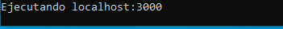
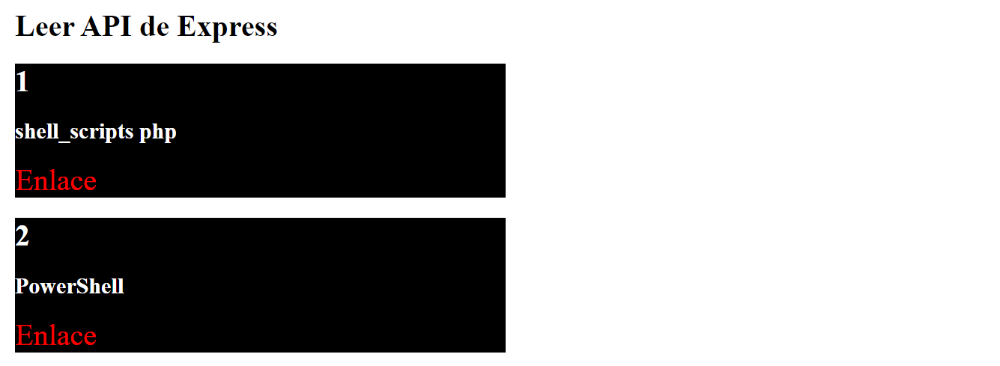
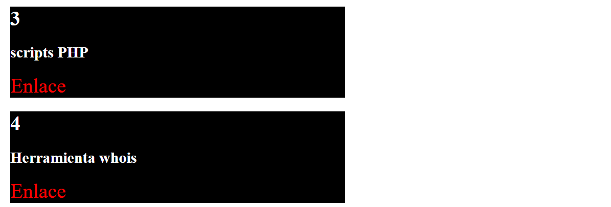

# angular_express
Consumir API Express con Angular en localhost

## Nodejs

La API
~~~~
node web.js
~~~~

Nos sale el mensaje :

Mirar en /yei

Aqui tenemos el json

~~~~
localhost:3000/yei
~~~~

## Angular

Para ejecutar la aplicación y se abra el navegador.
~~~~
ng serve -o
~~~~

